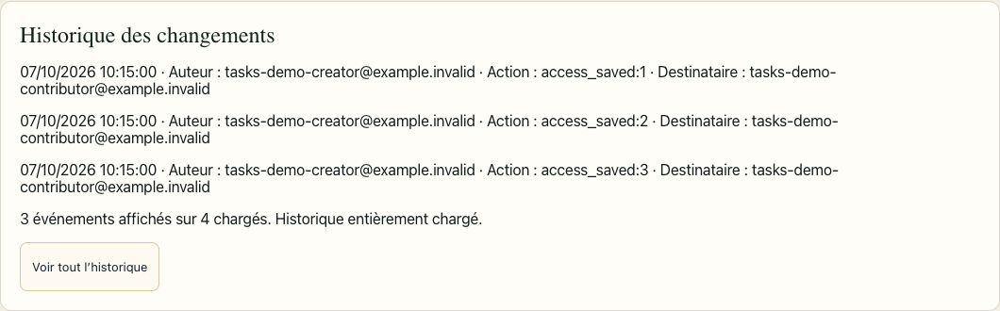
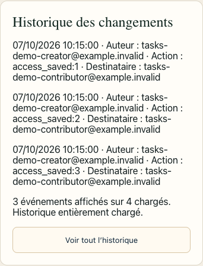

# Administration : modification et preuve locale

Le candidat basé sur `39aa89811258c2ff8438dc2bd49ed54f5fb58ea7` retire le
montage de `TaskIdentityAdministration` du panneau Administration. Son import,
son état `taskDirty` et sa contribution à `onDirty` sont retirés. Le signal des
autres formulaires reste `onDirty(dirty)`, avec nettoyage `onDirty(false)` au
démontage. Le diagnostic Google Drive, la matrice des droits, les rôles et
affectations IZORD, les invitations et leurs confirmations restent en place.
Aucun panneau de reprise ou masquage CSS ne remplace le composant retiré.

L’historique affiche les trois événements les plus récents, avec date, auteur,
action et destinataire. Pour plus de trois événements, « Voir tout l’historique »
ouvre les événements chargés et « Réduire l’historique » revient aux trois
premiers. Aucun bouton de repli n’apparaît pour zéro à trois événements.

`lib/access/AdminHistory.tsx` lit la nouvelle RPC par pages de 50, séparément de
`crm_admin_users()`. Les compteurs distinguent événements affichés, événements
chargés et pages plus anciennes restant à charger. « Charger les événements
plus anciens » poursuit le curseur ; aucun historique partiel n’est annoncé
comme entièrement chargé. Les IDs et curseurs bigint restent des chaînes.
Le repli conserve les pages déjà chargées. Une erreur conserve ces pages et
permet de réessayer le même curseur.

Les opérations restent dans `useScopedOperations('admin')`. La clé du composant
lie l’historique au compte, au snapshot d’accès et à la génération de rechargement.
Les réponses d’une lecture remplacée ou d’un composant démonté sont ignorées.
La pagination ne recharge ni utilisateurs ni droits et ne modifie pas les
brouillons d’accès ou d’invitation.

## Onze groupes navigateur validés

Le 7 octobre 2026, les onze groupes de
`tests/tasks/admin-simplification-administration-browser.mjs` passent sur le
candidat réellement servi à `http://127.0.0.1:3200`, avec comparaison des hashes
source/copie au manifeste. TypeScript, ESLint ciblé et `node --check` passent.

| Groupe | Résultat vérifié |
| --- | --- |
| 1. Zéro événement | État vide explicite, aucun bouton d’ouverture/repli, panneau d’identités absent. |
| 2. Un événement | Événement complet, aucun bouton d’ouverture/repli. |
| 3. Trois événements | Trois événements complets, aucun bouton d’ouverture/repli. |
| 4. Quatre événements | Trois par défaut, quatre après ouverture, trois après repli ; captures compactes ordinateur/mobile. |
| 5. 121 événements, largeur 1440 | Pages 50/100/121, curseur et ancre exacts, aucun doublon/omission, repli conserve les pages, aucune relecture utilisateurs/droits. |
| 6. 121 événements, largeur 390 | Même parcours avec émulation mobile et absence de débordement horizontal. |
| 7. Erreur de pagination | Événements chargés conservés ; reprise du même curseur après une réponse 503 simulée. |
| 8. Brouillon d’accès | Expansion/pagination/repli conservent la saisie ; changement d’utilisateur, invitation, navigation et déconnexion restent soumis à confirmation. |
| 9. Brouillon d’invitation | Saisie et droits conservés après navigation annulée et transport 503 simulé ; le brouillon reste signalé comme non enregistré. |
| 10. Rechargement | Nouvelle génération d’historique ; réponse tardive de l’ancienne page ignorée. |
| 11. Déconnexion/autre compte | Déconnexion Auth réelle confirmée, historique privé retiré, autre compte fictif connecté normalement, réponse de l’ancien compte ignorée. |

Les audits et le contrôle compact ne constatent aucun appel RPC
`crm_tasks_admin_directory`, `crm_tasks_admin_identity` ou `crm_tasks_legacy*`,
aucun montage `[data-task-identity-admin]` et aucune mutation
métier ou Storage. L’invitation POST est interceptée avant le serveur applicatif :
aucun transport réel ni email n’est envoyé.

La suite complète n’a pas été répétée pour produire les captures compactes :
seul le groupe « 4 events » a ensuite été exécuté, aux largeurs 1440 et 390,
avec `TASKS_ADMIN_BROWSER_FILTER='4 events:'`. Le code applicatif et son
manifeste sont restés inchangés.

Le résultat des onze groupes est conservé dans
`ADMINISTRATION.validation.json`. La reprise limitée aux captures est conservée
dans `ADMINISTRATION.compact.validation.json`. Les captures hautes de l’historique
ouvert à 121 événements restent des artefacts privés du banc ; elles servent à
documenter le parcours complet de la fixture, pas la présentation par défaut.

## Frontières de cette preuve

- Auth, les sessions de comptes fictifs `@example.invalid`,
  `crm_admin_users()` et `crm_access_snapshot()` utilisent réellement le banc
  Supabase local isolé, API port 55731. Aucun JWT ni session n’est fabriqué.
- Les réponses de `crm_admin_history_page` sont des fixtures de présentation,
  avec pages, grands IDs, réponse 503 et délai explicitement simulés. Les onze
  groupes navigateur ne constituent pas une preuve d’autorisation serveur de
  cette RPC ni une lecture d’un historique Production.
- Les sept groupes SQL/Auth/RPC réels de l’historique sont documentés séparément
  dans [SERVER.md](SERVER.md) : autorisations, sessions, pagination au-delà de
  100, bigint, curseurs invalides et préservation des données. Ils ne sont pas
  comptés parmi les onze groupes navigateur.
- Le diagnostic Google Drive est conservé dans le code ; cette suite ne réalise
  aucun appel Google. Aucune opération Production, publication, migration
  Production ou mutation de compte réel n’est réalisée.
- Le navigateur est Chromium local. La largeur 390 est une émulation, pas un
  test sur iPhone physique. Les résultats restent bornés au candidat et au banc
  fictif décrits ici.
